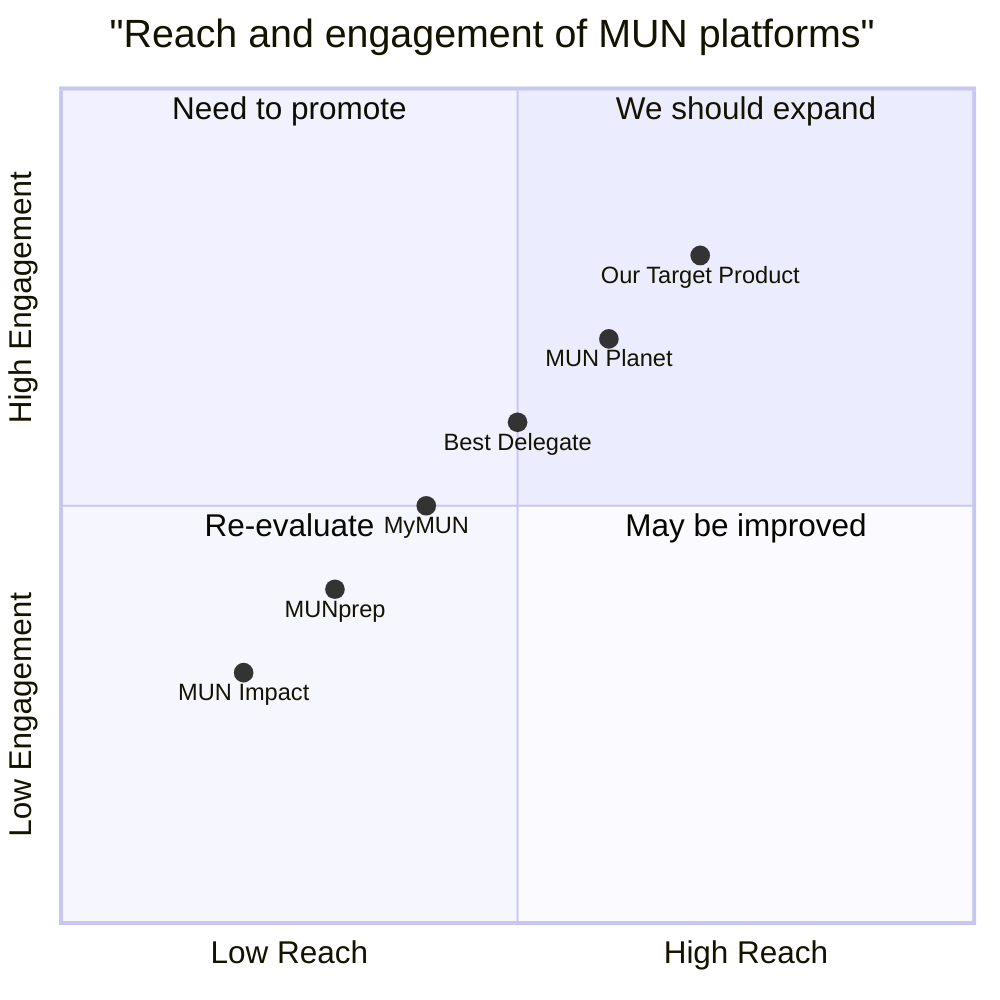

# DelegateMUN Product Requirement Document (PRD)

## Language & Project Info
- **Language**: English
- **Programming Language**: React, JavaScript, Tailwind CSS
- **Project Name**: delegate_mun

## Product Definition

### Product Goals
1. **Enhanced User Experience**: Provide a seamless and engaging user experience with dark mode and animations.
2. **Comprehensive Text Analysis**: Offer deep text-analysis tools tailored for MUN-related content.
3. **Efficient Navigation**: Ensure easy navigation through the website, especially within the documentation page.

### User Stories
1. **As a MUN participant**, I want to analyze MUN documents so that I can prepare more effectively.
2. **As a delegate**, I want to receive personalized feedback on my speeches so that I can improve my performance.
3. **As a researcher**, I want to quickly sift through large volumes of text so that I can save time and effort.
4. **As a user**, I want to navigate the documentation page easily so that I can find the information I need quickly.

### Competitive Analysis
1. **MUN Planet**: Pros - Comprehensive MUN resources; Cons - Lacks advanced text-analysis tools.
2. **Best Delegate**: Pros - Excellent training materials; Cons - No AI-driven analysis.
3. **MyMUN**: Pros - User-friendly interface; Cons - Limited analytical capabilities.
4. **MUNprep**: Pros - Good for beginners; Cons - No advanced features.
5. **MUN Impact**: Pros - Focus on social impact; Cons - Limited technical tools.

### Competitive Quadrant Chart

## Technical Specifications

### Requirements Analysis
- **Dark Mode Design**: Implement a dark mode theme across all pages.
- **Animations**: Add animations to enhance user engagement.
- **Navigation Planes**: Create navigation planes for the documentation page.

### Requirements Pool
- **P0**: Dark mode, main page, individual pages, documentation page.
- **P1**: Animations, navigation planes.
- **P2**: Advanced text-analysis tools.

### UI Design Draft
- **Main Page**: Overview of DelegateMUN features.
- **Individual Pages**: Detailed content for each feature.
- **Documentation Page**: Navigation planes for sections and files.

### Open Questions
- What specific animations should be included?
- How detailed should the navigation planes be?
